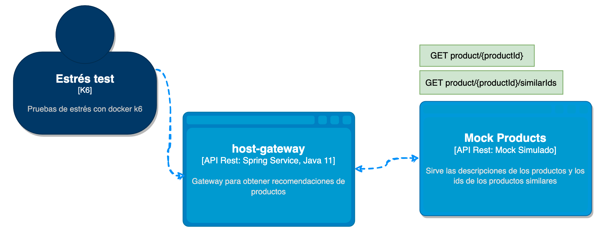
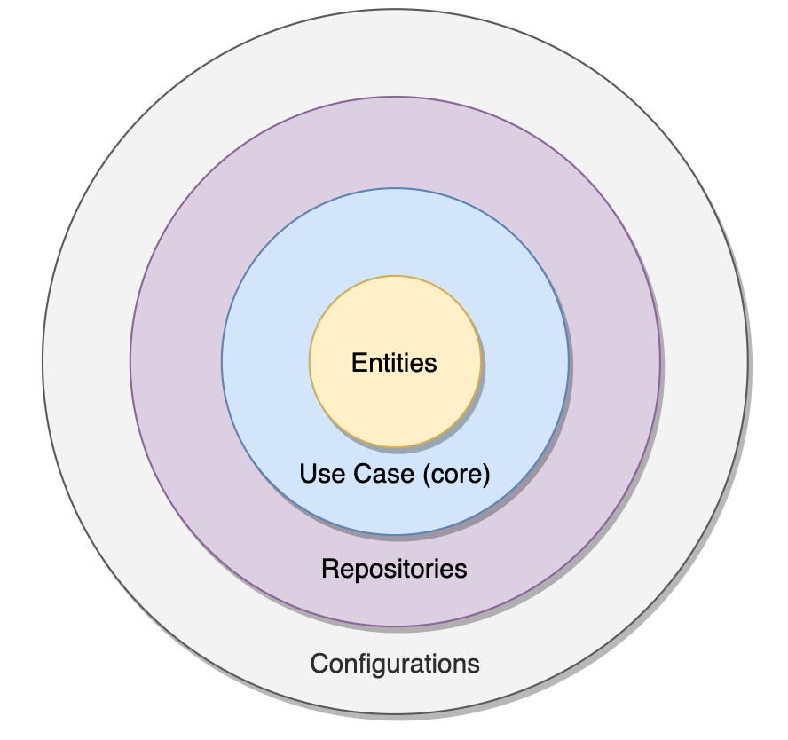
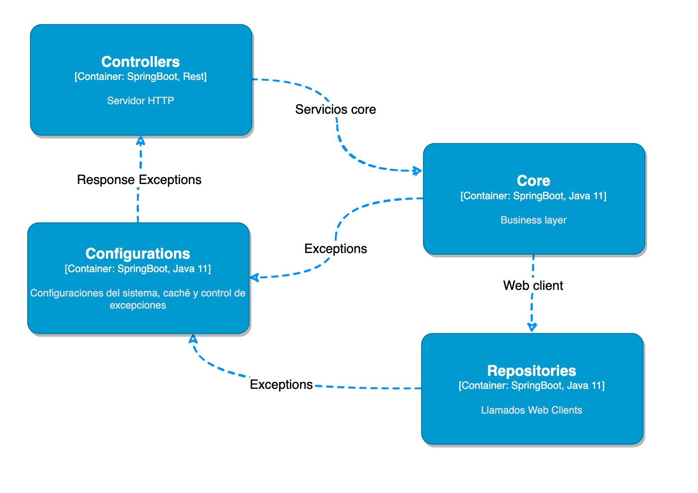

## Resumen

Esta aplicación (host-gateway) tiene como objetivo servir de proxy para la aplicación Mocks (simulado) que se encarga de ofrecer la similitud de los items de un ecommerce, esto tiene como objetivo poder mostrar recomendaciones para aumnetar las conversiones de ventas relacionadas

## Arquitectura

Para el manejo del diseño hemos realizado trata de mantener la separación de responsabilidades

Se definieron 4 componentes principales:

- Controllers
    - API Rest
    - Codigos de estado de respuestas HTTP
- Repositories
    - contiene el manejo de los web clients, en este caso el llamado a la aplicación Mocks y el Mapeo contra los DTO del Core
- Configuration
    - Contiene la configuración de los componentes de Controllers y Repositories
        - CacheConfig
            - Contiene las configuraciones de caché local
        - ExceptionConfig
            - Contiene el catch del manejo de excepciones del API
- Core
    - Contiene la lógica de negocio
    - Interfaces de entrada y salidas
    - DTOs
    - Pruebas unitarias
        - Se logró una cobertura de código al 100% en los servicios unicamente

## Operaciones

En el directorio between/ops contiene los archivos que componen el contendor docker de la solución.
La imagen creada se encuentra en el repositorio https://hub.docker.com/repository/docker/andresnator/between